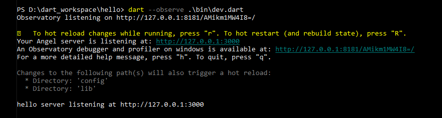

# Angel3 Hot Reloader


[](https://dart.dev/null-safety)
[](https://gitter.im/angel_dart/discussion)
[](https://github.com/dukefirehawk/angel/tree/master/packages/hot/LICENSE)



Supports *hot reloading* of Angel3 servers on file changes. This is faster and more reliable than merely reactively restarting a `Process`. This package only works with the [Angel3 framework](https://pub.dev/packages/angel3_framework).

**Not recommended to use in production, unless you are specifically intending for a "hot code push" in production.**

## Installation

In your `pubspec.yaml`:

```yaml
dependencies:
  angel3_framework: ^8.0.0
  angel3_hot: ^8.0.0
```

## Usage

This package is dependent on the Dart VM service, so you *must* run Dart with the `--observe` (or `--enable-vm-service`) argument. Usage is fairly simple. Pass a function that creates an `Angel` server, along with a collection of paths to watch, to the `HotReloader` constructor. The recommended pattern is to only use hot-reloading in your application entry point. Create your `Angel` instance within a separate function, conventionally named `createServer`.

You can watch:

* Files
* Directories
* Globs
* URI's
* `package:` URI's
  
```dart
import 'dart:async';
import 'dart:convert';
import 'dart:io';
import 'package:angel3_framework/angel3_framework.dart';
import 'package:angel3_hot/angel3_hot.dart';
import 'package:logging/logging.dart';
import 'src/foo.dart';

main() async {
  var hot = HotReloader(createServer, [
    Directory('src'),
    'main.dart',
    Uri.parse('package:angel3_hot/angel3_hot.dart')
  ]);
  await hot.startServer('127.0.0.1', 3000);
}

Future<Angel> createServer() async {
  var app = Angel()..serializer = json.encode;

  // Edit this line, and then refresh the page in your browser!
  app.get('/', (req, res) => {'hello': 'hot world!'});
  app.get('/foo', (req, res) => Foo(bar: 'baz'));

  app.fallback((req, res) => throw AngelHttpException.notFound());

  app.encoders.addAll({
    'gzip': gzip.encoder,
    'deflate': zlib.encoder,
  });

  app.logger = Logger('angel')
    ..onRecord.listen((rec) {
      print(rec);
      if (rec.error != null) {
        print(rec.error);
        print(rec.stackTrace);
      }
    });

  return app;
}
```

## Customising Response Header

The following code snippet removes `X-FRAME-OPTIONS` and adds `X-XSRF-TOKEN` to the response header.

```dart
import 'dart:io';
import 'package:angel3_hot/angel3_hot.dart';
import 'server.dart';

void main() async {
  var hot = HotReloader(createServer, [
    Directory('src'),
    'server.dart',
    // Also allowed: Platform.script,
    Uri.parse('package:angel3_hot/angel3_hot.dart')
  ]);
  var http = await hot.startServer('127.0.0.1', 3000);

  // Remove 'X-FRAME-OPTIONS'
  http.defaultResponseHeaders.remove('X-FRAME-OPTIONS', 'SAMEORIGIN');

  // Add 'X-XSRF_TOKEN'
  http.defaultResponseHeaders.add('X-XSRF-TOKEN',
      'a591a6d40bf420404a011733cfb7b190d62c65bf0bcda32b57b277d9ad9f146e');
}
```
