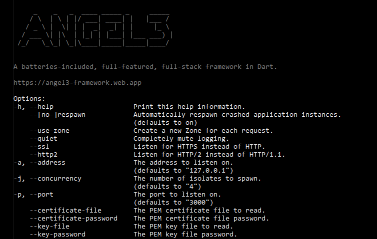

# Angel3 Production Runner


[](https://dart.dev/null-safety)
[](https://gitter.im/angel_dart/discussion)
[](https://github.com/dukefirehawk/angel/tree/master/packages/production/LICENSE)

Helpers for concurrency, message-passing, rotating loggers, and other production functionality in Angel3 framework.



This will become the de-facto way to run Angel3 applications in deployed environments, as it takes care of inter-isolate communication, respawning dead processes, and other housekeeping for you automatically.

Most users will want to use the `Runner` class.

## `Runner`

`Runner` is a utility, powered by `package:args`, that is intended to be the entry point of your application.

Instantiate it as follows, and your file will become a command-line executable that spawns multiple instances of your application:

```dart
import 'dart:async';
import 'dart:isolate';
import 'package:angel3_framework/angel3_framework.dart';
import 'package:angel3_production/angel3_production.dart';

void main(List<String> args) => Runner('example', configureServer).run(args);

Future configureServer(Angel app) async {
  app.get('/', (req, res) => 'Hello, production world!');

  app.get('/crash', (req, res) {
    // We'll crash this instance deliberately, but the Runner will auto-respawn for us.
    Timer(const Duration(seconds: 3), Isolate.current.kill);
    return 'Crashing in 3s...';
  });
}
```

`Runner` will automatically re-spawn crashed instances, unless `--no-respawn` is passed. This can prevent your server from entirely going down at the first error, and adds a layer of fault tolerance to your infrastructure.

When combined with `systemd`, deploying Angel3 applications on Linux can be very simple.

## Message Passing

The `Runner` class uses [`belatuk_pub_sub`](<https://pub.dev/packages/belatuk_pub_sub>) to coordinate
message passing between isolates.

When one isolate sends a message, all other isolates will receive the same message, except for the isolate that sent it.

It is injected into your application's `Container` as `pub_sub.Client`, so you can use it as follows:

```dart
// Use the injected `pub_sub.Client` to send messages.
var client = app.container.make<pub_sub.Client>();

// We can listen for an event to perform some behavior.
//
// Here, we use message passing to synchronize some common state.
var onGreetingChanged = await client.subscribe('user_upgraded');
onGreetingChanged
    .cast<User>()
    .listen((user) {
      // Do something...
    });
```

## Run-time Metadata

At run-time, you may want to know information about the currently-running instance, for example, which number instance. For this, the `InstanceInfo` class is injected into each instance:

```dart
var instanceInfo = app.container.make<InstanceInfo>();
print('This is instance #${instanceInfo.id}');
```

## Command-line Options

The `Runner` class supplies options like the following:

```bash
appuser$ dart example/main.dart --help
     _    _   _  ____ _____ _     _____ 
    / \  | \ | |/ ___| ____| |   |___ / 
   / _ \ |  \| | |  _|  _| | |     |_ \ 
  / ___ \| |\  | |_| | |___| |___ ___) |
 /_/   \_\_| \_|\____|_____|_____|____/                                                                                 

A batteries-included, full-featured, full-stack framework in Dart.

https://angel3-framework.web.app

Options:
-h, --help                    Print this help information.
    --[no-]respawn            Automatically respawn crashed application instances.
                              (defaults to on)

    --use-zone                Create a new Zone for each request.
    --quiet                   Completely mute logging.
    --ssl                     Listen for HTTPS instead of HTTP.
    --http2                   Listen for HTTP/2 instead of HTTP/1.1.
-a, --address                 The address to listen on.
                              (defaults to "127.0.0.1")

-j, --concurrency             The number of isolates to spawn.
                              (defaults to "4")

-p, --port                    The port to listen on.
                              (defaults to "3000")

    --certificate-file        The PEM certificate file to read.
    --certificate-password    The PEM certificate file password.
    --key-file                The PEM key file to read.
    --key-password            The PEM key file password.
```
